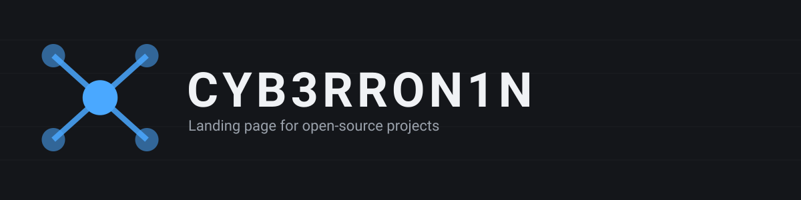

# Cyb3rRon1n.github.io

Source for [cyb3rron1n.github.io](https://cyb3rron1n.github.io/) — a single-page landing site linking to my open-source projects: [Vulcan](https://github.com/Cyb3rRon1n/vulcan), [Anvil](https://github.com/Cyb3rRon1n/anvil), [Atlas](https://github.com/Cyb3rRon1n/atlas), [Oracle](https://github.com/Cyb3rRon1n/oracle), [Nightwire](https://github.com/Cyb3rRon1n/nightwire), and [dojo](https://github.com/Cyb3rRon1n/dojo) — the last one being the "start here" band: a token-optimized, persistent coding toolchain (`dojo doctor` / `dojo tokens` keep it verified). The dojo band includes screenshots (`assets/dojo-menu-*.svg`) of its whiptail menu — rendered captures of the real menu generated from tmux, not mocked. To regenerate them, run `menu.sh` under tmux and capture-pane, then rasterize the ANSI with `dojo/ansiterm_svg.py`.

Self-contained `index.html` — no build step. Served directly by GitHub Pages on push to `main`; `.nojekyll` skips the Jekyll build since there's nothing for it to process.
